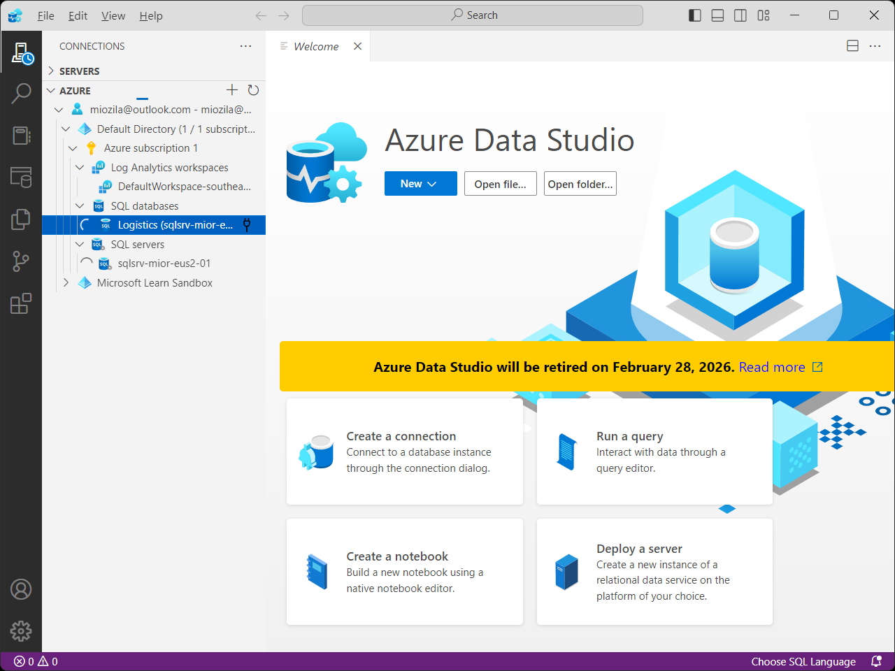
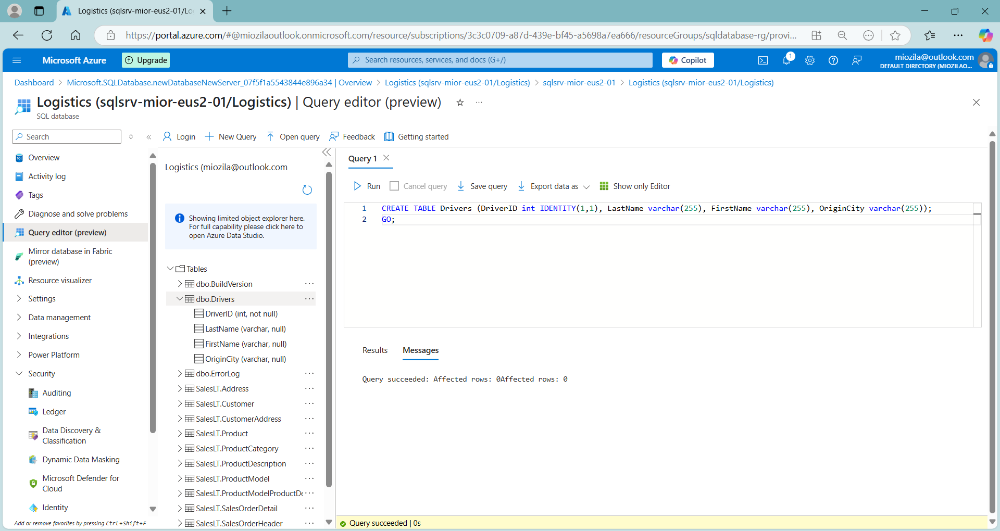
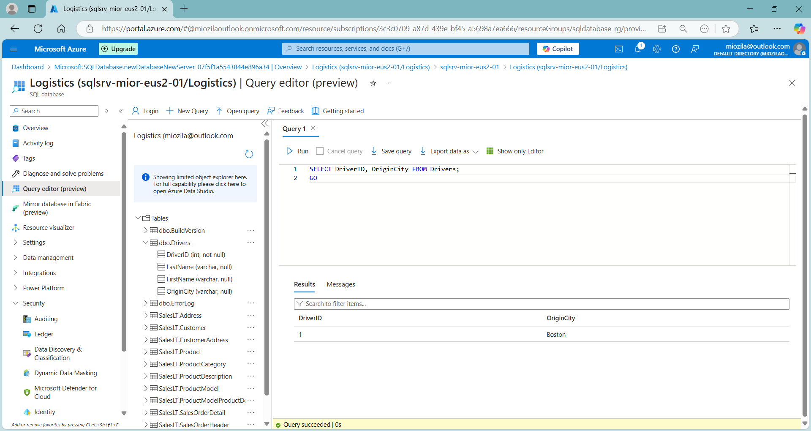
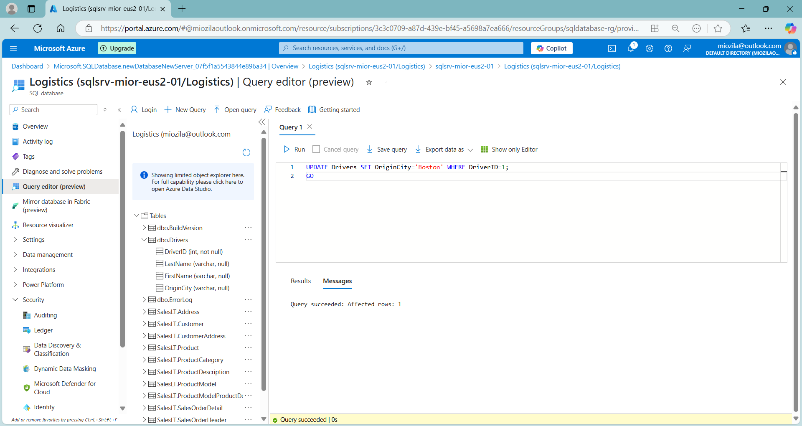
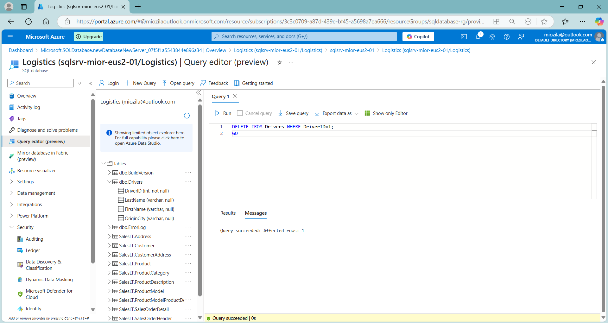
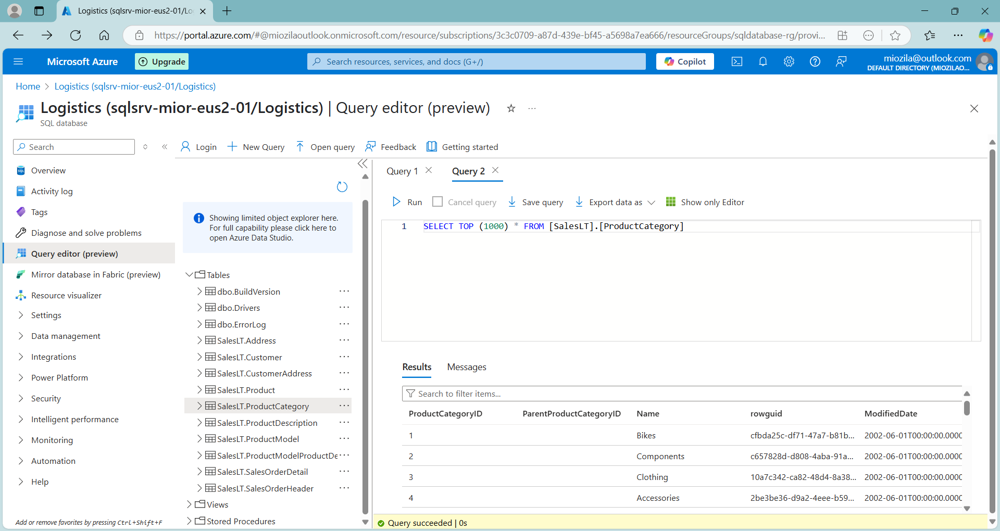
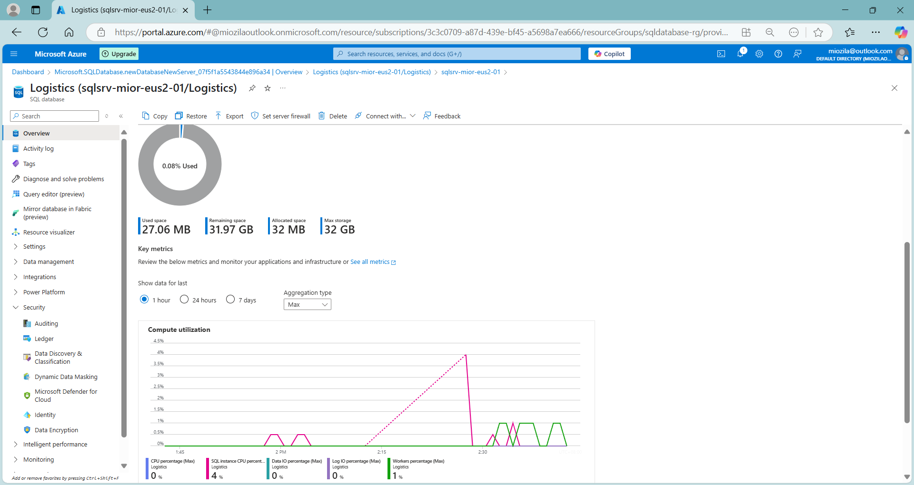

# azsqldb :office:
azsqldb : #azure_sql_db #rdbms

## Objective
To deploy Azure SQL Databass and perform CRUD Operation on relational database (RDB)

## Deployment: Logistics Database

## CRUD Operation

